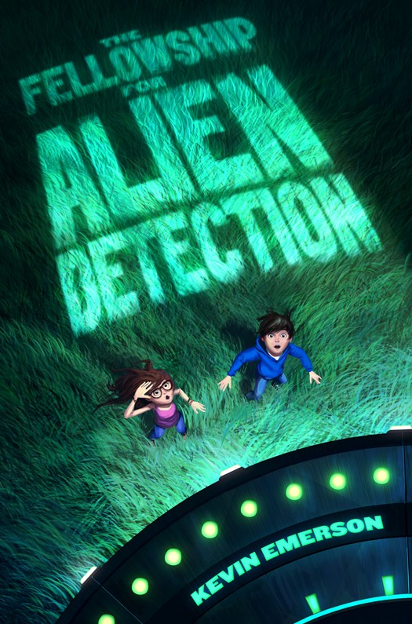

# The Fellowship for Alien Detection

**by Kevin Emerson**

## PART ONE
- [Chapter 0 - Juliette, Arizona, April 25, 7:00 a.m.](chapters/chapter_0.md)
- [Chapter 1 - Greenhaven, Connecticut, June 30, 2:14 p.m.](chapters/chapter_1.md)
- Chapter 2 - Greenhaven, Connecticut, June 30, 2:24 p.m.
- Chapter 3 - Greenhaven, Connecticut, July 2, 8:45 a.m.
- Chapter 4 - Amber, Pennsylvania, July 3, 10:12 a.m.
- Chapter 5 - Amber, Pennsylvania, July 3, 10:41 a.m.
- Chapter 6 - Winchester, Kentucky, July 4, 10:25 a.m.
- Chapter 7 - Memphis, Tennessee, July 4, 9:18 p.m.
- Chapter 8 - Memphis, Tennessee, July 4, 9:26 p.m.
- Chapter 9 - 8.5 kilometers west of Fort Bluff, Arkansas, July 4, 11:18 p.m.
- Chapter 00 - Juliette, Arizona, April 25, 6:45 a.m.

## PART TWO
- Chapter 10 - Port Salmon, Washington, July 3, 8:52 a.m.
- Chapter 11 - Port Salmon, Washington, July 3, 3:47 p.m.
- Chapter 12 - Near Bend, Oregon, July 4, 4:08 p.m.
- Chapter 13 - Near Bend, Oregon, July 4, 6:45 p.m.
- Chapter 14 - Burns, Oregon, July 5, 11:14 a.m.
- Chapter 15 - Lucky Springs, Nevada, July 5, 2:46 p.m.
- Chapter 16 - Roswell, New Mexico, July 6, 3:45 p.m.
- Chapter 17 - Roswell, New Mexico, July 6, 4:18 p.m.
- Chapter 000 - Juliette, Arizona, April 25, 6:46 a.m.

## PART THREE
- Chapter 18 - Gila National Forest, New Mexico, July 6, 8:36 p.m.
- Chapter 19 - Apache National Forest, Arizona, July 7, 12:36 a.m.
- Chapter 20 - Apache National Forest, Arizona, July 7, 3:45 a.m.
- Chapter 21 - Apache National Forest, Arizona, July 7, 4:17 a.m.
- Chapter 0001 - Juliette, Arizona, April 25, 6:55 a.m.
- Chapter 22 - 35° 23' N 113° 49' W, Arizona, July 7, 4:22 a.m.
- Chapter 23 - Approximately six hundred light-years east of Vega
- Chapter 24 - Juliette, Arizona, July 7, 5:43 a.m.
