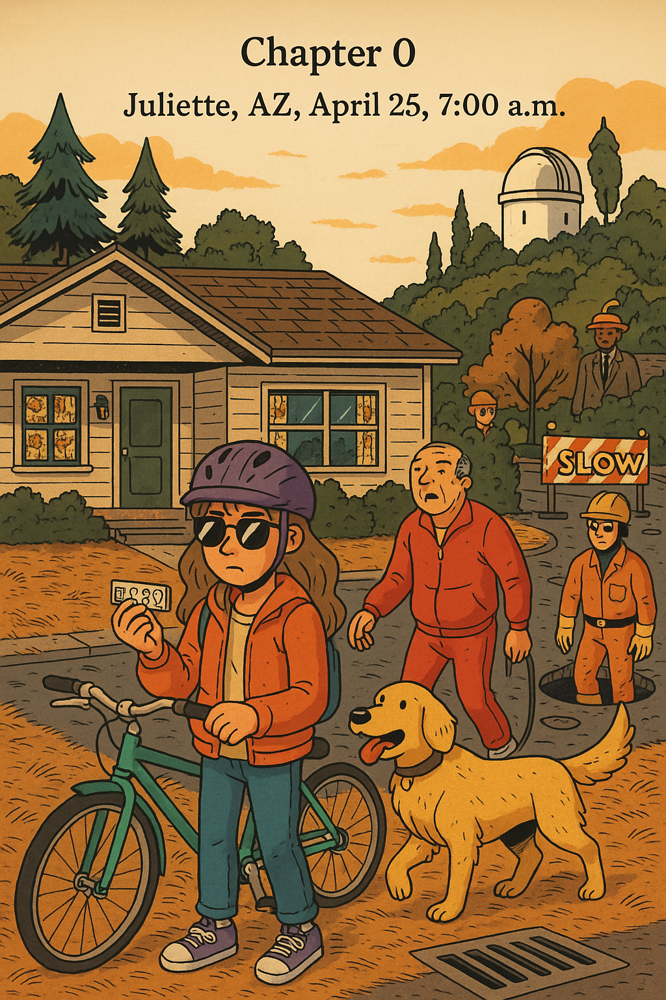

# Chapter 0

Juliette, Arizona, April 25, 7:00 a.m.

Suza Raines felt like something was wrong. She stood on her front porch after the screen door shut behind her. She stopped and thought: Mr. Davis will come by soon. He'll be wearing that red jogging suit and walking MacDougals.

And she was right! Mr. Davis walked around the corner right away. MacDougals was pulling on his leash and sniffing the gutters. The big golden retriever made swishing sounds with his long nose in the yellow pine needles. Mr. Davis walked fast. His bald head, red jogging suit, and white sneakers shined in the morning sun.

Suza shook her head and jumped down the stairs. There was nothing weird about that. Mr. Davis and MacDougals walked by at seven every morning. That was right after Mr. Davis came home from his night job at the power station. If anything was strange, it was that Suza was early enough to see them walk by. She was always late because she hated mornings. She didn't want anything to do with morning time. And she only needed ten minutes to bike to school (even though it always took fifteen).

So why was she so early today? Suza thought it had something to do with her alarm clock. It had acted really weird this morning. Instead of waking her up like usual with the happy voice of DJ Alpine and country music on KJPR, it had played a strange old song with a deep voice singing in another language. And then she couldn't read the time because the numbers looked broken. Some of the red bars were missing. So instead of hitting the snooze button a few times until her father Matt would come wake her up, she just got up. And now here she was: early.

Or was she? She pushed up her jacket sleeve and looked at her bare wrist. Where was her black and purple watch? The one with that weird old cartoon guy named Thundarr? He had no shirt and looked silly and had a dinosaur for a pet. The watch was cool because behind him, the moon was cracked in half. Her sister had bought it for her on eBay.

*Wait, that's silly,* she thought to herself. *You don't have a watch, and you don't have a sister.* That was strange. Why would she think that?

Then she had another weird thought: *Mr. Davis is going to trip and fall down.*

Suza was picking up her bike from the lawn covered in pine needles when Mr. Davis's left foot caught on a crack in the road. He fell over.

Suza tilted her head. She had known that was going to happen. But she needed to get going. Being early meant she had time to stop by the One Horse Diner. Her dad's friend AJ worked there and made the best breakfast sandwiches.

She rode down to the end of the driveway and stopped to button up her jacket.

She found Mr. Davis standing right in front of her. Another one of those weird thoughts came into her head: *He's going to give me something.*

"Have to give you this," said Mr. Davis in a dreamy voice. He reached into his pocket and pulled out a small metal rectangle. It was the size of a stick of gum, with little cuts in its sides. The metal was bright silver, but it also seemed to glow with rainbow colors under its surface.

Suza stared at the thing. For some reason, it looked familiar.

"Finally got it," Mr. Davis said. He sounded relieved. Then he leaned close to her. "You have to take it to the diner," he whispered.

Suza took the metal thing. It felt cool in her hand. She saw five symbols carved in a line across it, like those old Egyptian pictures.

She felt nervous. This looked familiar, but she wasn't sure how. "What do I do with this?" she asked.

"Not sure... You—you're supposed to take it to the diner so that we can—" Suddenly Mr. Davis froze. He looked around like there was a bug buzzing around his head. Then he slapped three times at the skin behind his left ear.

MacDougals barked in a worried way.

"What are you—" Suza started to say. But then a deep, strong voice spoke up in her head:

**NEVER MIND THAT, SUZA. NOW, HURRY ALONG. IT'S TIME TO GET TO SCHOOL.**

Suza reached up and slapped at the area behind her left ear too, like a bug was bothering her. She shook her head. What had she been doing? Oh yeah, going to school. She looked up at Mr. Davis. "Did you just say something?" she asked.

Mr. Davis looked down at Suza like he didn't even know her. "I— Did I?" He checked his watch. "Oh my. Come on, boy," he said to MacDougals. "Time to go!" He hurried off down the street. MacDougals looked back at Suza with big, sad eyes.

Suza watched them go. Then she realized she had something in her hand. She looked down at the metal thing. What was this? She felt like she'd seen it before, like it was important—

**THAT'S NONSENSE, SUZA. IT'S JUST A PIECE OF TRASH.** The firm voice washed across her brain like gentle waves, washing away her strange thoughts.

Suza threw the metal piece into the nearby storm drain. It clattered and disappeared.

**VERY GOOD. NOW, GET TO SCHOOL.**

Right. Suza pushed back her sandy brown hair, except for one curl that always jumped free in front of her eyes. She put on her helmet, slipped on her purple sunglasses, and pushed off on her bike.

Cold, sweet air touched her face. In the distance, a train horn echoed.

The road curved down the side of a hill covered with trees. Suza rode fast, wind roaring in her ears. To her left, the town of Juliette sat in its perfect square pattern on a flat, high desert with hills of yellow grass all around. A pale sun had just come up over the far mountains. The sun rays jumped across the flat brick buildings and lit up the hills and the snowy peak of Mount Randall far away. To her right, the white tower of the Foster Observatory stood like a castle on top of a rocky hill. The round top of the observatory was just finishing its last turn. Its curved steel roof slid closed like a sleepy eyelid.

The road flattened out and she rode into the waking neighborhoods. Street after street of one-story houses just like hers. Up ahead, a circle of orange plastic fence had been put up in the middle of the road. A big sign next to it said: "SLOW." Inside the fence, a manhole cover was open. As Suza rode around the construction, a head popped up out of the manhole. It was a man wearing a yellow hard hat and an orange jumpsuit.

*He'll stare at me when I go by,* Suza thought.

The man stared at her as she rode past. She didn't get a clear look, but it seemed like he was wearing small, black sunglasses. Wasn't that a weird thing to wear down in the dark?

**NOT AT ALL,** the voice told her. **TURN HERE TO GET TO SCHOOL.**

Suza almost did turn, but then she remembered her plan to go to the diner. She kept going straight. The houses turned into short brick buildings until she reached the traffic light at Main Street. Pickup trucks and Jeeps rumbled by. Their bumpers shined in the sideways sun. Exhaust clouds spun from their tailpipes.

Suza locked her bike to a parking meter and started walking down Main Street. As she walked, more strange predictions came into her head.

*It won't open for him,* she thought as she passed a man putting a quarter in the newspaper box.

"Oh, come on!" the man shouted, pulling hard at the handle.

*I'll bump into a fat lady in a yellow dress,* Suza thought as she pulled open the glass door to the One Horse Diner. She immediately crashed into a large woman who was just stepping out. Suza bounced back and looked up.

The woman glared at her over a giant coffee cup. "Why don't you—"

"I know. 'Watch where I'm going, half-pint,'" Suza finished for her. She shook her head and stepped into the warm, busy diner. She smelled syrup, coffee, and bacon grease. Her stomach growled loudly.

"Suze!" a voice called from behind the crowded counter. AJ was leaning through a small space between two customers. His white apron was already dirty with grease and ketchup. Right now it was hanging into someone's eggs. "How you doing, little lady?"

"Um." Suza looked left and right. More predictions were coming. So many at once... An old man was going to sip his coffee then cough hard. And he did. A young woman was going to laugh really loud and spit a piece of pancake onto the lady across from her. And she did. Woman in a cowboy hat leaving the bathroom... Check.

"Earth to Suze," AJ called. "Not awake yet, are ya?"

Actually, it felt like the opposite. Suza felt too awake. Too aware. She turned back to AJ with a blank face. *He'll ask me...*

"You here for the AJ Special? Bacon and peanut butter on whole wheat?"

Suza started to shake. It was like she knew everything.

"What's the matter?"

"You're going to be out of peanut butter."

"Nah, we've got plenty of..." AJ reached down into the cabinet below him. Then he looked at her in surprise. "Well, I'll be darned... I—" AJ's eyes suddenly went wide. His voice got quiet. "Hey, where's the— the thing? Did you bring it?"

"The—" Suza suddenly remembered the piece of metal. "Oh no... I threw it away!"

AJ looked around worriedly. "You were supposed to bring it, weren't you?"

"I was?" But yes, of course she was. That was the plan. "I'll go get it," said Suza.

"Hurry," said AJ.

Suza left the diner, running back up the street toward her bike. Understanding came flooding through her. *We need that piece of metal, because there's something wrong with this morning. But not just this morning. Every morning. And that piece of metal is a key to—*

**SUZA!** the voice in her head roared. **YOU WILL COME TO SCHOOL NOW! CALMLY AND RIGHT AWAY.**

Suza stopped where she was. She slapped behind her ear. All of a sudden, she felt calm again. Her breathing slowed. *Just get to school,* she thought. Right.

She grabbed her bike and rode slowly. She got to school a few moments later. Buses were pulling up in a line. Kids got off. Suza threw her bike against the bike rack and walked straight through the double doors, down the hallway decorated with pastel-colored paintings of April flowers.

**RIGHT THIS WAY, SUZA,** the voice said happily.

She reached the office and walked inside, straight past the front desk and right into the principal's office.

"Suza," Principal Howard's deep voice was soothing. He sat back in his wide leather chair behind his dark wood desk, smiling kindly at her.

She started to think: *His smile is fake and I have to get out of—*

**STAY RIGHT THERE, SUZA,** the voice in her head commanded.

Next to Principal Howard stood another short man in an orange jumpsuit and yellow hard hat. He wore black boots and small, oval sunglasses that looked more like swimming goggles, except they were pure black. He stepped toward her. Suza wanted to move, but she didn't. She couldn't.

"It happens, dear, now and then," Principal Howard told her. "But don't worry..." The orange-suited man put his hand around her wrist. It felt neither cold nor warm. "We'll make everything just like it was."

Suza looked down. Orange light began to spread from the man's palm. That feeling of knowing the future came over her strongly. "No, you can't do it again!" she screamed. Principal Howard stopped smiling. "This is all happening over and over! You can't! I won't—"

But her voice faded as orange light washed over her.

**Juliette, Arizona, April 25, 8:06 a.m.**

A few minutes later, Suza walked out of the office. She headed straight to class, where she slid into her desk and sat up straight, eyes on Ms. Fells, her math teacher.

"Good morning, Suza," said Ms. Fells, smiling sweetly. "Nice of you to join us. Do you have a note for being late?"

"Huh?" Suza wondered what she was talking about. She looked at the clock and saw that she was eight minutes late. How had that happened? Sure, she'd stopped by the office for a minute, but... Why had she even gone there in the first place?

"Suza?" Ms. Fells was now beside her. "It's all right, you're not in trouble." Suza watched Ms. Fells reach down and take a small, yellow pass out of her hand. "Now," Ms. Fells said, walking back to the front of the room, "let's get started."

Suza stared at her hand for another moment, then shrugged and began pulling her books out of her bag. What were they going to do in class today? She thought about it, but realized she had no idea.

After all, why would she?