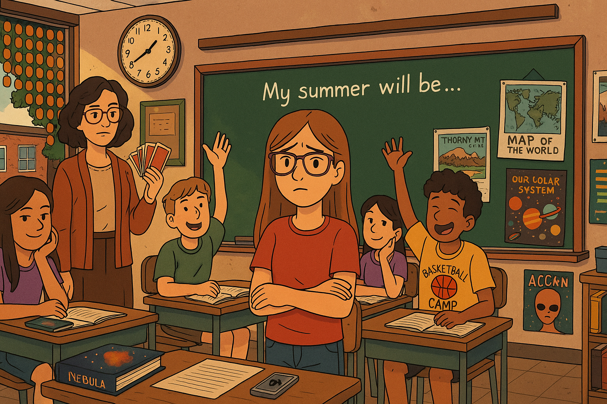

# Chapter 1

Greenhaven, CT, June 30, 2:14 p.m.

Haley Richards stared at the writing prompt on the board:

"My summer will be..."

"One more minute," Ms. DeNetto said. "Please finish up the sentence you're on."

Haley looked around. Most of her classmates had written a couple paragraphs and were now sitting back in the stuffy air, waiting for these last few minutes of the school year to go by. She looked down at her own page and saw nothing but light blue lines on empty white paper. Usually, she was one of the best writers in her eighth grade class, but today she hadn't written anything. How could she? Haley had no idea what her summer would be. She knew what it was supposed to be. She'd had it all planned out in what everyone knew was very typical Haley fashion. But then, as everyone in class also knew, things hadn't worked out. And now, not only was Haley's summer a blank page, but it felt like her whole future was unwritten.

"Okay, time's up." Ms. DeNetto walked to the front of the room. "And..." she said dramatically, "it looks like we will have time for a few last readers to end the year." A fluttering sound came from her hands. Ms. DeNetto was shuffling her Deck of Fates. Groans and sighs came from around the room.

Haley sat up. A rush of nervous energy hit her gut. It was a feeling she knew very well: a squirmy worry just below her belly. She sometimes imagined that it was caused by a tiny creature, a parasite or maybe some kind of stomach gnome. The feeling had been with Haley her whole life, like an old friend, or maybe enemy was more accurate. A little doubt creature riding along inside her, questioning every move and pointing out every possible flaw.

She slapped her notebook closed. A playing card was taped to the front: eight of diamonds. Each kid had a card, and Ms. DeNetto had a matching deck. If she picked your card, you had to read out loud to the class. And while a blank page might get some of her classmates out of reading, Haley knew that if she got picked, Ms. DeNetto would just ask her to talk about her summer anyway.

If she had to, Haley could talk about it, but she didn't want to. Didn't want to deal with everyone's judgment about what she wasn't doing, and didn't want to bother trying to explain what she actually was doing.

She looked at the clock. 2:15. Fifteen more minutes. That was about five readers. *Please don't pick me,* she begged the Fates. *Really, it's the least you could do.*

Ms. DeNetto drew the first card from the deck. "Five of spades."

Okay, one down. Little whispers of "Yes!" escaped around the room. Haley shared in that wave of relief, but only for a moment, because then she realized who had just been chosen. Madison Blake. Well played, Haley sneered to the smiling Fates. It looked like, as payment for not being called on, the Fates had decided to remind Haley of this summer's failures.

"My summer will be... a blooming garden of discovery," Maddy began dramatically. Haley reached back and pulled off her hairband, letting her brown bangs fall in front of her eyes so that she wouldn't be caught glaring. There were many things about Maddy that could make her jealous: how she said her T's extra clearly at the end of words and treated L's like they were made of fancy glass, the big fuzzy boots that she wore when it was even a little bit below fifty degrees, the terrible way that she'd dumped their classmate Beckett, and how calm and cool she always seemed to be, in all situations: never flustered.

But worst of all was her plan for the summer.

"First, I'll be planting fertile seeds of compassion at Habitat for Humanity Camp..."

That wasn't the part that bothered Haley, though it did sound fun.

"Then, I'll spend two weeks pruning and shaping my love for theater at Junior Shakespearean Society."

Not that part either...

"And then..." Maddy added a dramatic pause and even seemed to spend an extra second looking at Haley as her gaze swept across the room. "The fruits of a long sunny summer will ripen at Thorny Mountain Music Camp."

That part. Haley looked over at her best friend, Abby Warren. Abby gave her a sorry shrug. Abby was also going to Thorny Mountain, which was up north in the mountains of Massachusetts. She and Maddy were the only two kids going from the whole school. Haley had applied too, but she hadn't gotten in. It was so frustrating. Thorny Mountain was fun, and Haley was good at the flute. It made no sense! She'd been twice before.

But not only did Maddy get the thing that Haley wanted, she was also about to have the kind of summer that Haley was supposed to have. The kind you needed to have. Maddy was one of those kids who knew, like Haley did, that the summer after eighth grade was no time for fooling around, being a kid, and having fun. No matter what fuzzy old Mr. Kendrick, the school guidance counselor, said, you only had to do the math to know that you were running out of time: four summers—that was all that was left between now and when college applications were due. And college was the big time. You weren't just being compared to the little bubble of Greenhaven kids. It was going to be you against the whole wide world. You had to be ready.

And grades weren't enough. You had to have experiences. That's why the Madison Blakes of the world had put together summers full of high-quality college application goodness. And Haley had tried to do the same thing, only it hadn't worked out.

Maddy finished and Ms. DeNetto shuffled the cards again. "Jack of hearts."

Two down. The class was louder in their relief. Anders and Marco high-fived behind her.

But no, no! Haley couldn't believe it. As if Madison Blake wasn't bad enough, the next reader was Bradley Hong. Of all the people... Haley felt a tingle of fizzy energy reaching her fingertips. Her head felt spacey, like it was floating in water. She cast an evil eye up at the gleeful Fates. *This isn't subtle at all, you know.* Inside, the doubt creature squirmed with delight.

"My summer will probably be life changing," Bradley began in his quiet, painfully shy way. He stood hunched over, black hair a mess, staring at the floor as he spoke. Haley liked Bradley. He was sweet, and definitely who you wanted to be paired with for a research project, and it wasn't his fault that what he was about to say might well make Haley throw up.

"First I'll be at Camp Nucleus at MIT..."

Not that.

"Then I'm, um, doing fencing camp."

Or that.

"And then I go to New York for the Daily Times Junior Correspondent Fellowship."

That. That was the one.

More than anything else, it was Haley's dream to be a journalist. And JCF was the coolest, the only summer journalism program worth going to, anywhere, ever. This was the first year that they were old enough to apply, and if you won, you got to go to New York City for two whole weeks and work at the Daily Times as an intern for a real, actual, totally amazing journalist. And sure, you would spend a lot of time doing boring research or getting coffee (which in itself sounded somehow amazing), but also, also, your famous journalist mentor had to read and edit at least one original article by you, which would then be published in the Times online edition at the end of the program.

Haley had spent many moments during classes and meals, not to mention the hours drifting off to sleep, imagining herself at the JCF. She could picture her first day: walking up the stairs at Fifty-third and Lexington in the hot July sun and staring up at the steel-lined, modern front of the Daily Times Building. She would breathe in the air, and it would smell like hot dogs, and in her lungs and beneath her sweaty feet and in the beats of her heart she would feel the certainty of knowing that she was exactly where she was supposed to be, doing exactly what she was supposed to be doing.

Each day of the fellowship, Haley would be ready, ears alert for when the quiet pearls of journalistic wisdom were dropped near her. She'd be prepared, too, just in case there was ever a whisper in the offices of a Garrett Conrad-Wayne sighting—yes, the Garrett Conrad-Wayne, he of the grizzled beard and the beautiful writing and the reports from East Africa that made you dizzy with beauty and heartbreak at the same time.

Because what if, just what if, Haley could get Mr. Conrad-Wayne to notice her, maybe by mentioning that she followed him on Facebook and just so happened to have read all of his articles? And what if he was like, cool, and then, what if someday, years later...

A story would come through that he was too busy to take...

And he would remember that plucky Junior Correspondent...

And then it would be Haley, flying through rough tropical skies to a remote island village on the edge of the world, with sweat stains on linen shirt, weight of digital camera on neck, stained notebook on lap, sticking to knees.

Haley could picture it all, a big future in a big world, that started this summer...

Happening to Bradley Hong! This was so wrong! Writing wasn't even Bradley's favorite subject! Though he was annoyingly good at it. But his real passion was physics! Physics!

Meanwhile, Ms. DeNetto had chosen the next card. "Two of clubs."

Carl Powell walked up. At least he and Haley had no summer dreams in common. While Carl read about basketball camp, working at the movie theater, and how there would be free popcorn for his boys, and a few lucky girls, if you knew what he meant (Haley never really knew what Carl meant), Haley just stared out the window into the lazy June afternoon.

The air was faded tan, the fat green leaves of the maple trees swaying lazily in a hot, pollen-coated breeze. It was so June, so last-day-of-school, the world ripe with possibility, but... Haley wasn't going to New York this summer, or Thorny Mountain.

In fact, she'd be spending six of the eight weeks of vacation right here in Greenhaven with the Parks and Recreation Department, where she'd worked for the last three summers, and where life-changing opportunities included fishing trash out of the filters at the town pool, planting flowers around town hall, and then pulling weeds and shoveling pet messes and trying to keep those once-promising flowers from dying in the long, hot sun, day after day, running in place, time slipping by.

And yet...

All that said, the summer wasn't totally a loss, because for those remaining two weeks of summer, there was something that Haley was doing. And when Haley could put aside her disappointment about the Times and Thorny Mountain, she was able to remember that this other thing was a big thing. Well, maybe. It might also be nothing. Haley didn't know yet, and that was the main reason for her blank page.

It was also the reason why she didn't want to get called on right now. It was one thing to go up in front of the class and talk about things like the JCF, or Thorny Mountain, or State Select Soccer or whatever because everybody knew what those things were, and they all sounded serious and real. Haley's other thing might well be amazing. It was possibly bigger than anything anyone else was doing, but the problem was, it didn't sound like it from the description. In fact, it sounded kind of crazy. Haley knew this, and so she'd tried to keep it secret, but thanks to chatty parents and nosy teachers, there were no secrets in middle school.

She'd already heard the jokes, from kids like Kaz and Dawn and Carl. And she'd heard the grumblings from parents and from her relatives: What kind of summer opportunity focused on aliens? How could that possibly be serious?

Yep, these were the joys of winning the Fellowship for Alien Detection. And yet, Haley knew that what she'd discovered, the theory that had led to her winning that fellowship, was actually very serious, mind-blowingly serious, at least, again... maybe. She wouldn't know until next week, when she got out on the road, and so, in the meantime, she just wanted to get out of this classroom without having to try to explain herself to a bunch of immature kids—

"Eight of diamonds."

Unbelievable.

"Haley," Ms. DeNetto said enthusiastically, probably thinking Haley would rescue the tone of the presentations after Carl's popcorn giggle fest.

Haley sighed to the Fates. Fine. She slid out of her desk and started toward the front of the room.

"Haley, aren't you forgetting your notebook?"

"No," said Haley.

Some annoying classmates had already started snickering to one another.

Haley reached the front of the room and felt a sudden surge of nerves. She felt her T-shirt sticking to her back, her jeans sticking to her legs, and her glasses sliding down her nose. There was a hot feeling on the back of her neck. She should have left her hair up! She tried to take a deep breath, but her lungs seemed to hit a wall.

*What if they're right?* said the doubt creature. *It might all be silly. It might all turn out to be nothing.*

Quiet! she snapped. Then she took a deep breath. *You can do this,* she told herself. *Forget about how the fellowship SOUNDS. Just tell them about the story.*

Yes. The thought calmed her. The story she'd uncovered, the story that had won her the fellowship...

Her classmates might be laughing now, but they wouldn't be after Haley told them about the mystery of Suza Raines.
