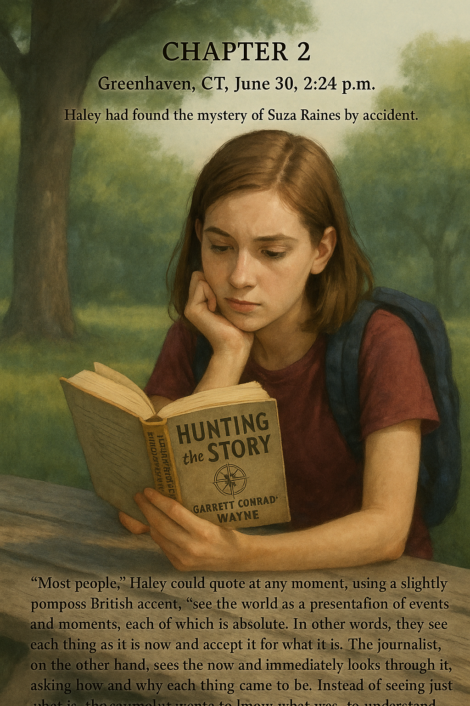

# Chapter 2

Greenhaven, CT, June 30, 2:24 p.m.

Haley had found the mystery of Suza Raines by accident.

But if you read *Hunting the Story*, the collected essays, thoughts, and cocktail recommendations of Pulitzer Prize–winning journalist Garrett Conrad-Wayne, or better yet, if you owned a dog-eared copy that you kept in your backpack at all times like Haley did, then you knew the truth was something different:

"Most people," Haley could quote at any moment, using a slightly pompous British accent, "see the world as a presentation of events and moments, each of which is absolute. In other words, they see each thing as it is now and accept it for what it is. The journalist, on the other hand, sees the now and immediately looks through it, asking how and why each thing came to be. Instead of seeing just what is, the journalist wants to know what was, to understand why, and to dream of what could be."

Here Haley would often add a burly chest cough, from years of good scotch whiskey and bad cigarettes, and also to make Abby smile, before continuing: "This awareness by the journalist is the Sixth Sense for Story. Most of the time, the answers are quickly found by using our own knowledge or looking at the world around us for clues, but sometimes, when the questions cannot be answered right away, the Sixth Sense tingles. And when it tingles, the journalist knows that somewhere behind the surface lies a story waiting to be found, and the hunt is on."

That was how it had begun for Haley, with a tingle in her mind, and this feeling just happened to strike during some serious time-wasting on Facebook.

Thinking back on it now, it had been so random: Haley had been sitting around one evening, in the middle of January, enthusiastically avoiding comprehension questions about *I Am the Cheese*. She'd been scrolling through the babble of status updates when she looked down one of those random rabbit holes that can open up online.

First, an update had caught her eye from a friend of hers and Abby's, named Mia. Three photos appeared in a row on Mia's wall. She was at a wedding. The first photo showed Mia with a microphone, her face bright red, hamming it up with two other girls doing karaoke. The second showed Mia standing in a group with the bride. And then in the third, she was by a sunny table of snacks, waving happily at the camera, with a big grin around a mouthful of food. Standing beside her at the table was a heavy girl with a frown and black-rimmed eyes and bright pink hair.

And it was this girl who accidentally got photographed that caught Haley's attention. Unlike Mia, who wore a flower-printed dress, this girl was in jeans and a red T-shirt. She had lots of jelly bracelets on her wrists, and her bangs were held back with thick black hair clips. Kind of a weird look for a wedding, Haley had thought.

She'd then noticed the writing on the T-shirt. It read, "We Are the Missing."

Haley maybe thought it was a band. So this was some typical emo chick whose parents were lazy and let her get away with too much, like going to a wedding without dressing up.

But... there was something more, and now, it was hard to remember exactly what. Had it just been the T-shirt? Or had it also been the look in the girl's eyes, which seemed more sad than just pouty...

Maybe it had been that look. Haley ran her cursor over the girl, saw she'd been tagged, and clicked on her name: Stephanie Raines.

And that was just about the end of the line. Stephanie's profile was locked for friends only, so you couldn't see anything.

However, there was one photo on her wall that had been made visible to everyone. It showed a smiling girl, leaning on her bike in a driveway. She wore round glasses, and her face was covered with freckles. She looked maybe a little younger than Haley.

And the caption below it read: "Please help find my sister."

And then there was a link: www.wearethemissing.net

It wasn't a band name.

Haley slid over the photo. The girl leaning on the bike was tagged Suza Raines. Her profile was locked too. She was a happy-looking girl, someone who seemed down-to-earth and fun. She didn't look like a runaway, not that Haley really knew what that would look like. And she wondered: What had happened to this girl?

And even at that point, it may still have been mostly about avoiding homework, but as Haley had opened a new browser tab to search for "We Are the Missing," she'd felt the tingle growing. There was something here—she just knew it. And the feeling almost seemed dangerous. A voice in her head told her not to look any further, to go back to her schoolwork.

Maybe that voice knew how Haley could get obsessed with something that interested her, and that there was no time for this, not with homework and after-school newspaper club and flute lessons and, at the time, those unfortunate Irish-step-classes-that-shall-not-be-talked-about, and of course that essay Haley wanted to get a head start on for the JCF application. But Haley had not been able to fight her Sixth Sense.

The search results for We Are the Missing came up. It was a network of people claiming to have experienced alien visits. Their blogs and sites were full of wild claims, everything from having been taken aboard spaceships and turned briefly into animals, to stories of being forced by near-crazy aliens to go to drive-through windows and order hundreds of hamburgers, which they apparently had huge cravings for, and so on, but whatever these people claimed, the constant was that everyone reported experiencing missing time events—situations in which periods of time had passed that no one could remember—and some of them also claimed to have lost people: friends, family members, sisters... like Suza.

And from there, Haley was gone. Homework, flute lessons, even that JCF essay, none of it stood a chance. Night after night, all winter and into spring, Haley had spent endless hours reading accounts of missing time and missing people, and all that research had led her to discover a pattern. Then, the advertisements on various websites led her to the Fellowship for Alien Detection, and finally, the theory she described in her application, based on the pattern she'd found, won her that fellowship, and...

And... it had done more than that. Because if Haley were really honest with herself, she would have to admit that the story of Suza Raines had taken over her life so much that she had totally rushed her applications to the JCF and Thorny Mountain and had barely gotten them in at all.

It was this story, this mystery that her Sixth Sense had been powerless to ignore, that had not only led to her winning the FAD, but also to missing out on those other opportunities.

Of course Haley had wanted to win them all, but, when compared to her discoveries about Suza Raines, those other opportunities felt... safe. They were official, known, whereas the FAD was risky, wild. Its mysteries were uncharted, and it felt like it had the most potential for something Haley could only describe as "new map." Worlds unseen, horizons unexplored... the FAD had the potential to change the shape of her whole life. Getting that story assignment from Garrett Conrad-Wayne when she was in college? How about getting a huge story next week? And then who knew what the future might hold after that, what undiscovered worlds Haley might be able to get to. New map. That was the thing. And even if her theory ended up being wrong, there was still the road trip and its promise of sights, sounds, and country that she'd never seen. Everything about the FAD was literally over the horizon from the life she knew. And that was what Haley wanted more than anything.

But the price had been losing out on those other opportunities... and having to stand in front of class and defend the FAD's oddities, now.

"You didn't write anything?" asked Ms. DeNetto, sounding confused.

"No."

"Well, can you tell us what you'll be doing anyway?"

Someone snickered. It was Kaz. She and Dawn and Carl were grinning at Haley now like hungry hyenas.

"Little green men," Haley heard Dawn mumble to Kaz.

"Little green boyfriend," Kaz replied. They both cracked up.

Haley wondered yet again at her classmates' ability to think they were so old, and yet act so completely childish at the same time.

The doubt creature took control again. *They might be right,* it said. *How can there really be aliens out there? And if there are, how is some thirteen-year-old from Connecticut going to find them?*

This was a good point. One that had tripped up Haley more than once. Generations of scientists, not to mention crazy RV-driving, ham radio–operating, aluminum-foil-helmet–wearing freaks, had come up empty in the search for evidence of aliens and UFOs.

But no... No, she told the doubt creature. None of them had what she had: an actual story. And so, no, she was not going to stand up here and be a joke. She was not going to give in to doubting herself, because she knew what she had. And in fact, she remembered now that she had her keys in her pocket, and on her key chain she had something that was better than a notebook essay. Oh yeah, she thought to herself, that's what a real journalist would do. And so after one last check-in with Abby's encouraging eyes, Haley went for it.

"Okay," she said brightly. "So, I won something called the Fellowship for Alien Detection, and while most of you might think that sounds silly, you won't after you hear my winning theory."

She dug into her pocket, pulled out her keys, and held her thumb drive out toward Ms. DeNetto. "May I?" she asked.

"Oh, um, sure," said Ms. DeNetto.

Haley slid the drive into a port on the computer at the front of the room. It was connected to the projector. She scrolled through and clicked on her files, stopping on a slide-show presentation called INTRODUCTION. She'd made it for when she was on her research trip, for introducing herself to people she wanted to interview, and on the off chance that she ended up being interviewed herself by any town officials or local media. This was actually the perfect opportunity to try it out and see if it worked.

On the white screen at the front of the room, a photo appeared. The simple presence of an image immediately quieted the class, and Haley felt a serious tone settle over the room. She wished she'd been able to squash the nerves and doubt creature earlier to think of this. It would have saved her so much anxious energy, but better late than never.

She paced in front of the photo. Her shadow was thrown at a high angle behind her.

"This is Suza Raines," said Haley, sweeping a hand toward the girl on her bike. "Originally from Amber, Pennsylvania. Reported missing six months ago. She remains missing to this day, and there have been no leads in the case." Haley let a beat pass. A paragraph change. She looked around. Even Kaz was suddenly staring forward.

"On the night of her disappearance," said Haley, "fourteen people in Amber reported experiencing the effects of Missing Time, meaning they believed they had skipped over a period of time that they could not remember at all. Their accounts were all different, and none could be proven, but what matters is that they all had one answer in common. When asked how long they'd been missing, they all said the same thing: sixteen minutes. Well, all except for Suza, because she didn't come back."

Haley clicked to the next slide.

This one showed a map of the United States. Red dots were drawn all over it.

"Now, people report alien abductions all the time. With the internet, there are thousands of reported cases, many of them by weirdos with stories that make no sense. But here and there, as the red dots show, large groups of people within a town have reported this phenomenon of having lost sixteen minutes of time."

Haley cued the next slide. Same map. Fewer dots.

"And in many of those same towns, at least one person has been reported missing at right around the same time, if not the same night, as the missing time event."

Haley stopped and faced her class. Even the gum chewing had stopped. "So you might ask, how did these people know about this missing time, and why don't they have any proof?" She clicked again, and the next slide showed a bulleted list that read:

• Disorientation
• EMP Loss
• Network Reconnect

"There are three reasons," said Haley. "First, the people didn't really understand what had happened at first. It took at least a minute or two for people to snap out of their trance and suspect what had happened. For some, they never even knew until they heard about it from someone else. Many people thought they'd just dozed off for a minute, as the event happened late at night, and so they just got on with their lives.

"Second, there is another interesting coincidence among these towns: They all experienced computer problems and electric problems similar to an EMP burst—that's an electromagnetic pulse. The power went out briefly and many hard drives, appliances, anything with a microchip were either damaged or wiped clean. Internet service was down until power was restored, and servers were reset.

"Third, cell phones, if they weren't wiped out completely by the EMP effect, would have reset, and when they connected to the network, the time would have immediately updated.

"As a result, the only people with any actual evidence of this sixteen-minute time loss were the ones who happened to have an analog watch, or clock, anything mechanical that was frozen for the same amount of time that the people themselves were. And some of those people just shook their heads and reset their watches before they knew any better. Add that to the confusion, the data loss, and"—Haley finished—"there's very little proof that these things even happen. And, let's be honest, reports of alien abduction and missing time sound a little crazy."

"Then how do you know it's even true?" asked Madison, with her best skeptic's sneer.

Haley felt a little jolt. Time for the big reveal... "Well, one thought I had was to look at town webcams for the abduction nights, since lots of towns have cameras to keep track of live weather and traffic and stuff. I wanted to see if, you know, UFOs showed up or something. The thing was, the data for those nights had been messed up by the EMP effect. But then it was while I was looking at this photo that I noticed something."

Haley clicked to the next slide. It showed a photo of an old brick building with a tower in the center. On the tower was a clock.

"Here's a webcam of the town hall in Gable, New Hampshire. Gable had widespread reports of a missing time event back in March. This screenshot of the webcam is from two days after the reported incident, once they got things back up and running. But there's something wrong with this picture. Anybody see what it is?"

Her classmates squinted. Abby raised her hand with wild enthusiasm.

"Yes, Ms. Warren?" Haley asked with a grin.

"The time is wrong!" said Abby.

"Right." Haley stepped up to the photo and pointed. "The webcam is live. Here's the time next to the date. See it? Six-forty p.m. But the town hall clock says..."

"Six-twenty-four?" Carl asked as if telling time was new to him.

"Exactly," said Haley. "Sixteen minutes off. That clock has since been corrected, but it got me thinking. Lots of town clocks are antiques, big, old, analog. And someone has to manually fix the time when it's wrong. So I checked and found that Amber, the town where Suza went missing, had a webcam on its town green too, and you could see the clock on the town hall. I called the town offices in Amber and asked to see their webcam footage. I said I was doing a story on the number of people using public spaces, and so I was going to count the number of people on their town green by the hour each day."

"You lied?" asked Beckett, sounding shocked, or maybe amazed.

"Well," said Haley, "kind of..." She hadn't thought of it as lying, but more like how Garrett Conrad-Wayne had put it: Stories are cunning and hard to catch, and often use people's own fears and insecurities as camouflage. The journalist must not be afraid to do what is necessary to see through this dense foliage, to, if necessary, camouflage themselves and their intentions in order to get the information they need.

Haley liked that explanation better than lying, and like Wayne had said, it had been necessary.

"Anyway, so they sent me the files, and sure enough, right after the reported missing time and Suza Raines's disappearance, the town clock was off..."

"Sixteen minutes?" said Beckett, on the edge of his seat.

Haley nodded with some dramatic flair of her own. "Sixteen minutes." She flipped through a few more webcam photos. "All this winter and spring, whenever new reports of towns with abductions and missing time appeared online, I would try to find a webcam with a clock tower, either in their downtown or at a mall or whatever."

"The clock over at the Waterbury mall is always wrong," said Kaz, her tone now one part confused and one part trying to be helpful. "Is that aliens?"

"Mmm, I don't think so," said Haley. "I also got a couple other towns to send me files, like I did with Amber. And the sum of all this research is..."

Haley clicked again and a final map appeared, this one with just eleven dots.

"Over the past three years, these are the places where I have direct evidence of missing time events, in the form of these photos. There are over twenty others where the evidence is strong, but I don't have webcam images to back it up.

"And so for the next two weeks, I'm taking a road trip to visit these sites and interview the people there about anything they might—or might not—remember. Any questions?"

Silence.

A long, low beep sounded, announcing the end of the school year.

"Have a good summer," said Haley, and she walked to her desk, picked up her books, and started for the door.

Haley and Abby walked home through steamy afternoon air that smelled like hot tar and lilies. They briefly visited the cool of the SpeedyMart for diet grape sodas and cucumber-flavored soy chips, then stopped to eat them on a bench outside the town pool, surrounded by a chlorine-scented breeze that was fluttery with laughter.

"That was an awesome display of nerd power," said Abby.

"Ha, thanks," said Haley.

"Are you still bummed about the Times?"

"A little," said Haley. "But mostly no." She'd moved fully to hoping that her award-winning FAD story could make it all the way to the tablet of Mr. Conrad-Wayne as he sipped chai in a Nairobi lounge. Likely? No. Possible? Yes.

They both drank and munched quietly. Haley wondered what was on Abby's mind, but she also thought she knew. Now that school was over and she was headed home, it was on her mind too.

Finally, Abby said, "Did you tell your parents yet?"

Haley took a big bite of chips before responding. "Well..." she said around the mouthful.

"Haley..."

Haley swallowed and sighed. "Not really," she said, and by "not really" she meant "not at all."

"How's that going to work?" Abby asked, sounding worried.

It bothered Haley. She didn't like people worrying about her, but maybe she was more bothered right then because she knew her friend had a right to be. "Well," said Haley, "I figure they don't really need to know. I mean, as far as they're concerned, we're just driving around for two weeks, with me interviewing people who think they were visited by aliens, seeing what they say. It never has to come up until I'm safe at home writing the article."

"Sure," said Abby, "but if any of it is true..."

And here was the problem that Haley and Abby had discussed before: If it turned out aliens weren't behind the events, then what happened to those missing people? And if, though probably very unlikely, there really were aliens out there, how were they going to feel about someone trying to uncover their story? Would that person end up missing too?

That was maybe scary. And it was directly related to the one thing that Haley hadn't bothered to mention to her parents... She hadn't told them about Suza Raines, or any of the other reports of abductions. Clock towers and missing time? Yes. Missing people? No. She'd left that part out of her application until after her mom had proofread it.

"They wouldn't have let me go," Haley said quietly.

"Maybe," said Abby.

Haley felt like it was a certainty. Missing persons cases were serious, after all, and bound to activate her parents' protective instincts. Wouldn't they be right to feel that way? the doubt creature pointed out. Sure, but Haley would tell them if things started to feel dangerous. *Are you sure about that?* She was. Mostly. "And besides," said Haley, trying to ignore a rustle of nerves inside, "it's like Conrad-Wayne says, sometimes you have to camouflage yourself—"

"Yeah, but Haley, Garrett Conrad-Wayne is an adult. You're thirteen."

Haley didn't like talking about this. And she hated how the doubt creature was feasting on it. *What if she's right?*

Haley also hated having a secret from her parents, hated the cold, damp feeling she was getting down her arms from thinking about it. She stood up. "Yeah, well, they trust me. They told me this was my thing, and they would just be along for the ride... so, I'll just have to be careful."

She hoped it sounded like she meant being careful in terms of avoiding any aliens wrapping their long green fingers around her, but Haley maybe really meant about her parents finding out. Because she needed this. She had to get out there, to follow this story over the horizon.

Abby stood and looked at her seriously. "You better be careful. Don't do anything too crazy."

"I won't," said Haley, but she almost felt like she was lying again. Not like she was the type to do something crazy, but what if that's what it took? "When do you go to Thorny Mountain?" she asked, hoping to change the subject.

"Monday," said Abby. "Will you be in the Kingdom?" Abby was referring to Macabre Kingdom, the online world where they hung out to gossip and do battle with evil demons.

"Whenever there's Wi-Fi," Haley replied. "Have fun in music land."

"You bet." Abby smiled. "My goal is a new boyfriend, preferably a cello player with a name like Nico or Alvin."

Haley smiled as big as she could. "Good luck."

"You too. Be careful," Abby said seriously. She hugged Haley, and then gave her a mocking wink and a pretend boy-punch on the shoulder. "Have fun, bro." They shared a small laugh and parted ways at the next intersection.

Haley walked the last quarter mile home lost in thought. In two days, she was actually heading out to hunt a story. For real. And what would she find? What was possible? Were there really aliens out there? Maybe the missing people were just runaways or people looking for an excuse to get away. Maybe this was all a hoax. But maybe it was real.

A hot summer wind rushed over her, making her jeans stick to her legs, pushing her damp bangs into her eyes. Haley looked up at the sky, the blue washed to a pale haze. She smelled the sweet smell of flowers bursting in yards, felt summer's whisper of possibility.

What would her summer be? Two days until the road. Two days till she would finally find out.

And only two more days during which she had to hide the truth from her parents.